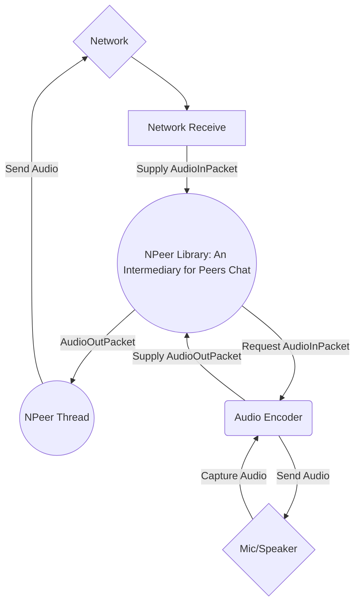

# NPeer
A Library that provides an intermediary between the Network and Audio Encoder/Decoder
## How it works
Circles = things provided by NPeer
Rectangles = things NPeer needs to interface with (aka things you need to provide)

